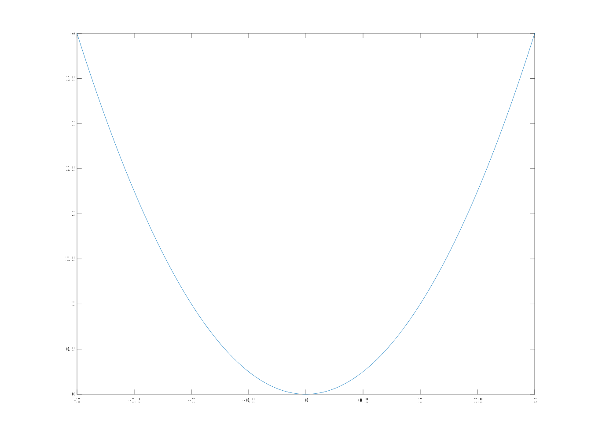
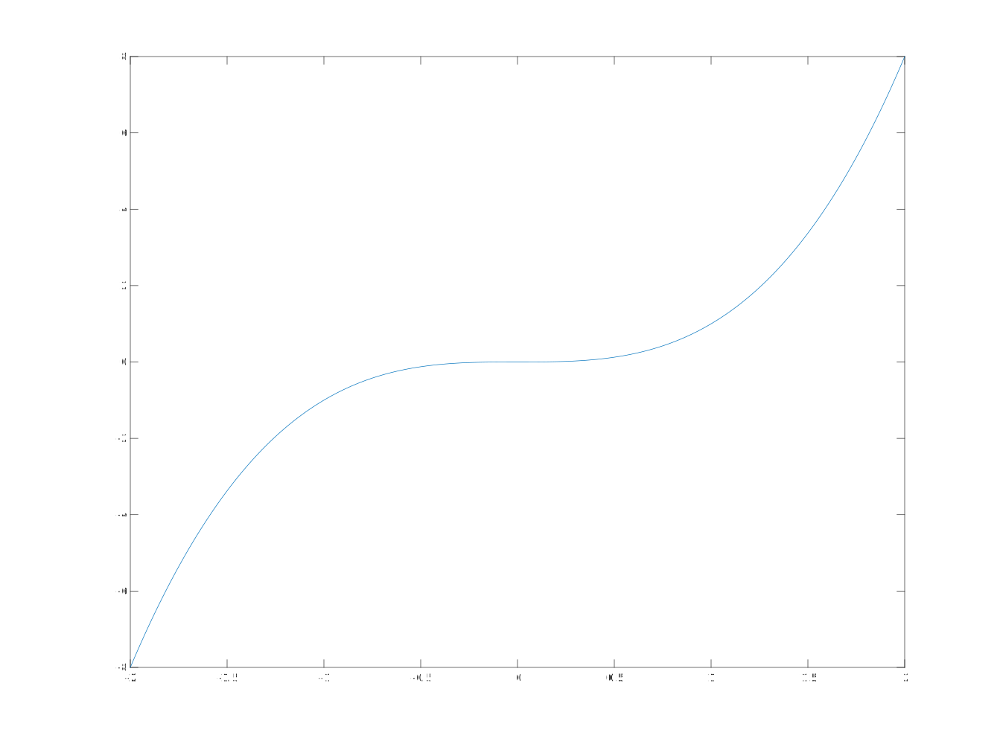
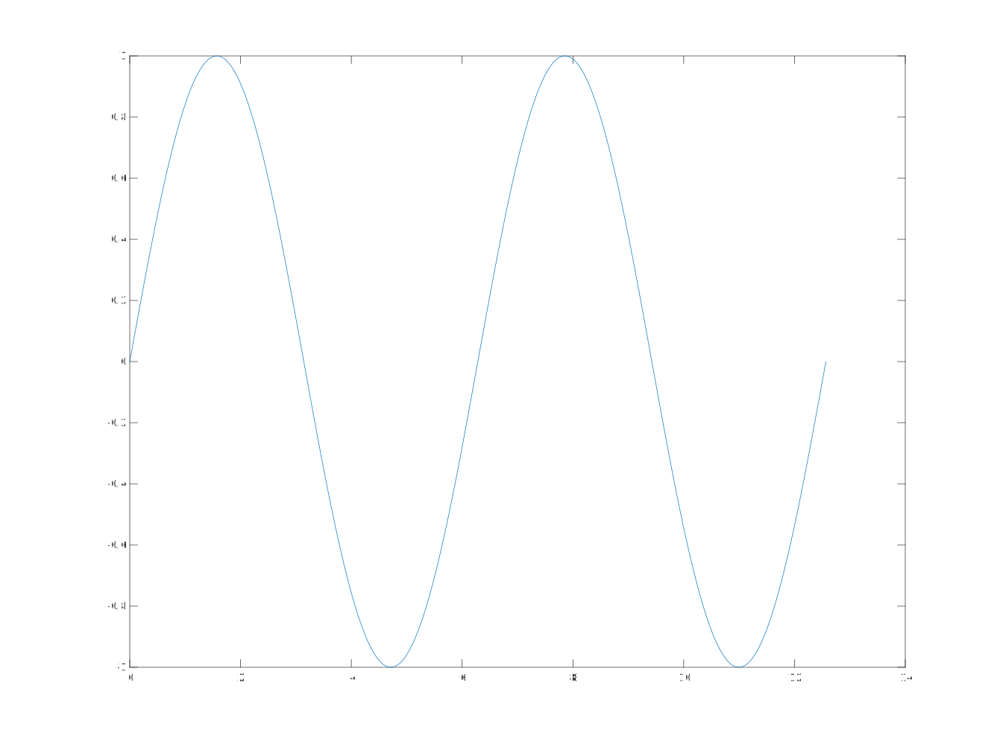

AI数学
===
介绍AI领域相关的数学

## 基础数学
### 常数
#### $\pi$
$$ \pi = \frac{圆的周长}{圆的直径} $$
#### e
是一个无限不循环的小数，是对数中的一个常量，前3位为2.17.
如果 $N=A^x(x>0, x \neq 1)$，那么x叫做以a为底，N的对数,叫做$x=log_aN$，其中a叫做底数，N叫做真数
$$e = \lim_{x\to\infty}(1+\frac{1}{n})^n$$
- 以10为底的对数叫做常用对数，用$lgN$表示
- 以`无理数e`为底的对数叫自然对数
- 0没有对数
- 实数范围内，负数没有对数。虚数范围内，负数有对数

## 高等数学
### 函数
函数表示量和量之间的关系，`y=f(x)`，有时候
- 函数在$x_0$处的函数值
$y_0=y|_{x=x0}=f(x_0)$
#### 表现形式

##### 分段函数
$$
y(x)=
\begin{cases}
    \sqrt{x} , (x \geq 0)\\
    -x ,  (x \lt 0)
\end{cases}
$$
##### 反函数
调换自变量和因变量的位置
$y=x^2$
反函数
$x=\sqrt{y}$
##### 显函数&隐函数
$ y = x + 1 $
隐函数
$ y - x - 1 = 0 $

#### 特性
##### 奇偶性
- 偶函数
关于y轴对称，$f(x) = f(-x)$

y轴显示在中间有点麻烦，*放弃*
- 奇函数
关于原点对称, $f(-x)=-f(x)$

##### 周期性
周期性重复的函数,$f(x)=f(x+T)$，其中T是周期，sin(x)的周期是2*pi, $\pi$

$sin(x)=sin(x+2\pi)$
##### 单调性
- 单调递增
- 单调递减
### 极限
#### 数列
安装一定次序排列的数字，{${u_1, u_2, u_3, u_4, u_n,...}$}，$u_n$叫做通项
#### 极限
{$u_n$}当n无限大时,其通项接近于一个常数A,则称做`该数列以A为极限`或称做`数列收敛于A`，否则称数列为`发散`
收敛
$$ \lim_{n\to\infty}u_n=A $$
- 极限符号含义
    - 当|x|无限增大
    $$ \lim_{x\to\infty}$$， 
    - 当x无限增大时
    $$ \lim_{x\to+\infty}$$, 
    - 从x无限减少时
    $$ \lim_{x\to-\infty}$$
    - 当x无限逼近于${x_0}$
    $$ \lim_{x\to{x_0}}$$， 
    - 当x从$x_0$的右边无限接近${x_0}$
    $$ \lim_{x\to{x_0^+}}$$， 
    - 当x从$x_0$的左边无限接近${x_0}$
    $$ \lim_{x\to{x_0^-}}$$， 
