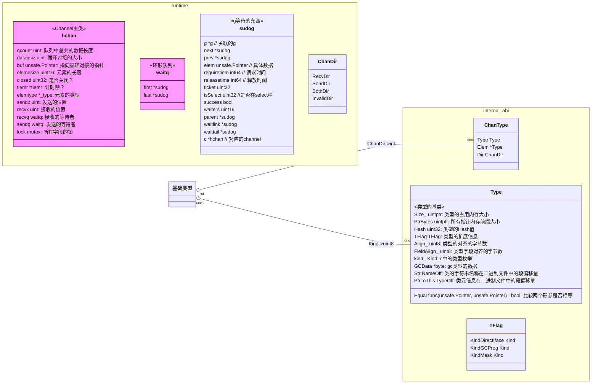
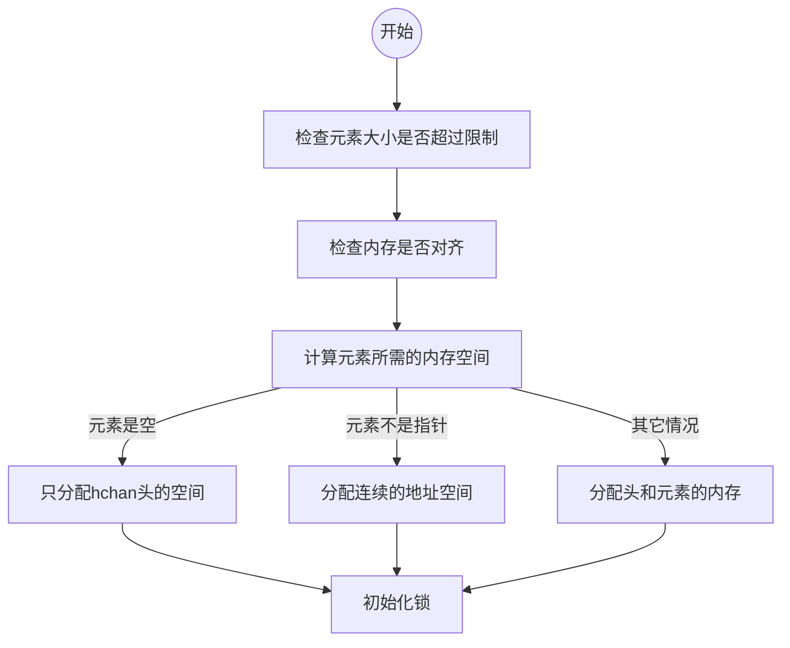
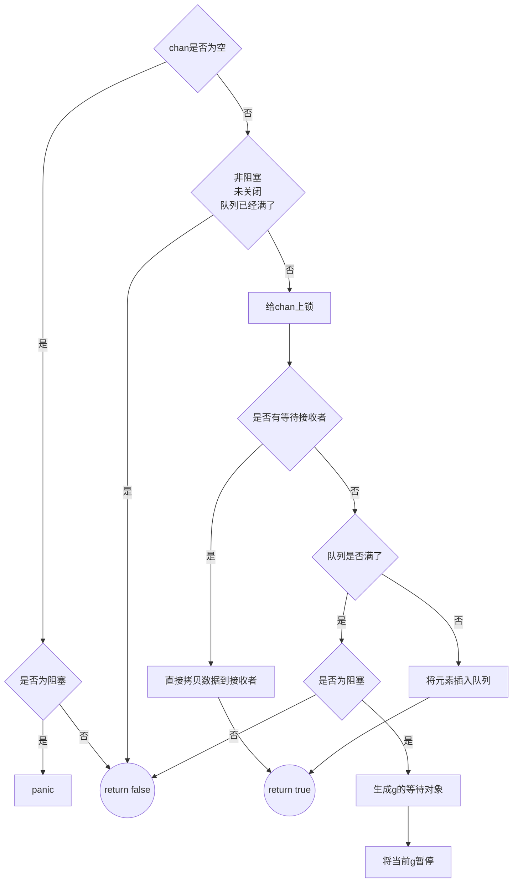
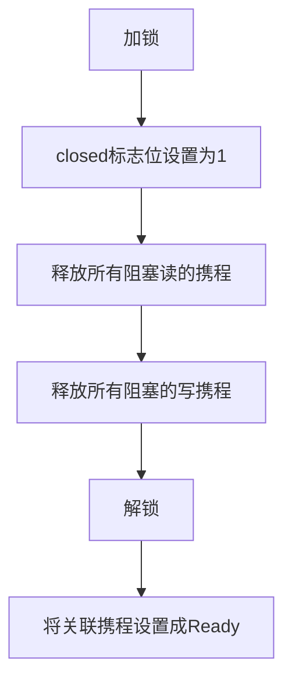

<!-- @import "[TOC]" {cmd="toc" depthFrom=1 depthTo=6 orderedList=false} -->

<!-- code_chunk_output -->

- [运行时源码解析](#运行时源码解析)
	- [底层分析](#底层分析)
	- [数据结构](#数据结构)
	- [runtime.makechan](#runtimemakechan)
		- [流程图](#流程图)
	- [runtime.chansend](#runtimechansend)
		- [源码](#源码)
		- [流程图](#流程图-1)
	- [runtime.chanrecv](#runtimechanrecv)
		- [源码](#源码-1)
		- [流程图](#流程图-2)
	- [runtime.closechan](#runtimeclosechan)
		- [源码](#源码-2)
		- [流程图](#流程图-3)

<!-- /code_chunk_output -->


## 运行时源码解析
### 底层分析
我们写一个简单的channel代码，查看汇编(go语言自己的中间语言)代码，go代码如下
@import "demo/chan/make.go"
我们再使用`go tool compile -S -N -l -m ./demo/chan/make.go > ./demo/chan/make.s`,make.s的go汇编中间码如下
@import "demo/chan/make.s"

在go汇编中，很轻易的可以看到，分别调用了`runtime.makechan`，`runtime.chansend1`，`runtime.chanrecv1`。
### 数据结构
- UML图

- 数据结构如下图所示


### runtime.makechan
文件在`src/runtime/chan.go`中，代码片段如下。
```go
func makechan(t *chantype, size int) *hchan {
	elem := t.Elem

	// compiler checks this but be safe.
	// 大小不能超过64k
	if elem.Size_ >= 1<<16 {
		throw("makechan: invalid channel element type")
	}
	// 检查内存是否对齐
	if hchanSize%maxAlign != 0 || elem.Align_ > maxAlign {
		throw("makechan: bad alignment")
	}

	// 计算元素所需要的内存 mem=单个元素大小*元素个数
	mem, overflow := math.MulUintptr(elem.Size_, uintptr(size))
	if overflow || mem > maxAlloc-hchanSize || size < 0 {
		panic(plainError("makechan: size out of range"))
	}

	// Hchan does not contain pointers interesting for GC when elements stored in buf do not contain pointers.
	// buf points into the same allocation, elemtype is persistent.
	// SudoG's are referenced from their owning thread so they can't be collected.
	// TODO(dvyukov,rlh): Rethink when collector can move allocated objects.
	var c *hchan
	switch {
	case mem == 0:
		// 元素大小为0，只需要分配hchan本身的内存
		// Queue or element size is zero.
		c = (*hchan)(mallocgc(hchanSize, nil, true))
		// Race detector uses this location for synchronization.
		c.buf = c.raceaddr()
	case !elem.Pointers():
		// 当元素不是指针类型，分配连续的空间大小（chan本身需要的内存和元素需要的内存）
		// Elements do not contain pointers.
		// Allocate hchan and buf in one call.
		c = (*hchan)(mallocgc(hchanSize+mem, nil, true))
		c.buf = add(unsafe.Pointer(c), hchanSize)
	default:
		// 分别分配chan本身的内存空间和元素的内存空间
		// Elements contain pointers.
		c = new(hchan)
		c.buf = mallocgc(mem, elem, true)
	}

	// 设置元素的相关参数
	c.elemsize = uint16(elem.Size_)
	c.elemtype = elem
	c.dataqsiz = uint(size)
	// 初始化chan的锁
	lockInit(&c.lock, lockRankHchan)

	if debugChan {
		print("makechan: chan=", c, "; elemsize=", elem.Size_, "; dataqsiz=", size, "\n")
	}
	return c
}
```
#### 流程图

### runtime.chansend
#### 源码
```go
/*
 * generic single channel send/recv
 * If block is not nil,
 * then the protocol will not
 * sleep but return if it could
 * not complete.
 *
 * sleep can wake up with g.param == nil
 * when a channel involved in the sleep has
 * been closed.  it is easiest to loop and re-run
 * the operation; we'll see that it's now closed.
 */
func chansend(c *hchan, ep unsafe.Pointer, block bool, callerpc uintptr) bool {
	if c == nil {
		// chan为nil
		if !block {
			// 如果是非阻塞，直接返回
			return false
		}
		// 如果是阻塞情况，直接暂停当前g，抛出异常
		gopark(nil, nil, waitReasonChanSendNilChan, traceBlockForever, 2)
		throw("unreachable")
	}

	if debugChan {
		print("chansend: chan=", c, "\n")
	}

	if raceenabled {
		racereadpc(c.raceaddr(), callerpc, abi.FuncPCABIInternal(chansend))
	}

	// Fast path: check for failed non-blocking operation without acquiring the lock.
	//
	// After observing that the channel is not closed, we observe that the channel is
	// not ready for sending. Each of these observations is a single word-sized read
	// (first c.closed and second full()).
	// Because a closed channel cannot transition from 'ready for sending' to
	// 'not ready for sending', even if the channel is closed between the two observations,
	// they imply a moment between the two when the channel was both not yet closed
	// and not ready for sending. We behave as if we observed the channel at that moment,
	// and report that the send cannot proceed.
	//
	// It is okay if the reads are reordered here: if we observe that the channel is not
	// ready for sending and then observe that it is not closed, that implies that the
	// channel wasn't closed during the first observation. However, nothing here
	// guarantees forward progress. We rely on the side effects of lock release in
	// chanrecv() and closechan() to update this thread's view of c.closed and full().
	if !block && c.closed == 0 && full(c) {
		// 如果非阻塞，并且chan没有关闭，并且chan满了，直接返回false
		return false
	}

	var t0 int64
	if blockprofilerate > 0 {
		t0 = cputicks()
	}

	// 给chan上锁
	lock(&c.lock)

	if c.closed != 0 {
		// 如果chan关闭，解锁并且panic
		unlock(&c.lock)
		panic(plainError("send on closed channel"))
	}

	if sg := c.recvq.dequeue(); sg != nil {
		// Found a waiting receiver. We pass the value we want to send
		// directly to the receiver, bypassing the channel buffer (if any).
		// 如果有接收者在等待，则直接将数据给接收者
		// 有接收者在等待，说明缓冲区中已经没有数据了
		send(c, sg, ep, func() { unlock(&c.lock) }, 3)
		return true
	}

	if c.qcount < c.dataqsiz {
		// Space is available in the channel buffer. Enqueue the element to send.
		// 如果队列还有空闲空间
		// qp指向下一个插入位置的指针
		qp := chanbuf(c, c.sendx)
		if raceenabled {
			racenotify(c, c.sendx, nil)
		}
		// 把发送的元素(ep)放入插入位置的指针
		typedmemmove(c.elemtype, qp, ep)
		c.sendx++
		if c.sendx == c.dataqsiz {
			c.sendx = 0
		}
		c.qcount++
		unlock(&c.lock)
		return true
	}
	// 下面是队列已经满了的情况
	// 这种情况下会将当前的g放到发送携程的队列中

	if !block {
		// 非阻塞模式下，直接返回
		unlock(&c.lock)
		return false
	}

	// Block on the channel. Some receiver will complete our operation for us.
	// 如果是阻塞的，并且队列发送已经满了，则把它放到等待发送的队列中
	// 获取当前的g
	gp := getg()
	// sudog是g需要等待的东西
	// 这里是申请一个sudog
	mysg := acquireSudog()
	mysg.releasetime = 0
	if t0 != 0 {
		mysg.releasetime = -1
	}
	// No stack splits between assigning elem and enqueuing mysg
	// on gp.waiting where copystack can find it.
	mysg.elem = ep
	mysg.waitlink = nil
	mysg.g = gp
	mysg.isSelect = false
	mysg.c = c
	gp.waiting = mysg
	gp.param = nil
	c.sendq.enqueue(mysg)
	// Signal to anyone trying to shrink our stack that we're about
	// to park on a channel. The window between when this G's status
	// changes and when we set gp.activeStackChans is not safe for
	// stack shrinking.
	gp.parkingOnChan.Store(true)
	// 将当前的g暂停
	gopark(chanparkcommit, unsafe.Pointer(&c.lock), waitReasonChanSend, traceBlockChanSend, 2)
	// Ensure the value being sent is kept alive until the
	// receiver copies it out. The sudog has a pointer to the
	// stack object, but sudogs aren't considered as roots of the
	// stack tracer.
	// 确保ep保持活动状态，直到接收者将其复制出来
	KeepAlive(ep)

	// someone woke us up.
	if mysg != gp.waiting {
		throw("G waiting list is corrupted")
	}
	gp.waiting = nil
	gp.activeStackChans = false
	closed := !mysg.success
	gp.param = nil
	if mysg.releasetime > 0 {
		blockevent(mysg.releasetime-t0, 2)
	}
	mysg.c = nil
	releaseSudog(mysg)
	if closed {
		if c.closed == 0 {
			throw("chansend: spurious wakeup")
		}
		panic(plainError("send on closed channel"))
	}
	return true
}
```

#### 流程图


### runtime.chanrecv
#### 源码
```go
// chanrecv receives on channel c and writes the received data to ep.
// ep may be nil, in which case received data is ignored.
// If block == false and no elements are available, returns (false, false).
// Otherwise, if c is closed, zeros *ep and returns (true, false).
// Otherwise, fills in *ep with an element and returns (true, true).
// A non-nil ep must point to the heap or the caller's stack.
func chanrecv(c *hchan, ep unsafe.Pointer, block bool) (selected, received bool) {
	// raceenabled: don't need to check ep, as it is always on the stack
	// or is new memory allocated by reflect.

	if debugChan {
		print("chanrecv: chan=", c, "\n")
	}

	if c == nil {
		if !block {
			return
		}
		gopark(nil, nil, waitReasonChanReceiveNilChan, traceBlockForever, 2)
		throw("unreachable")
	}

	if c.timer != nil {
		c.timer.maybeRunChan()
	}

	// Fast path: check for failed non-blocking operation without acquiring the lock.
	if !block && empty(c) {
		// 非阻塞环境队列是空的
		// After observing that the channel is not ready for receiving, we observe whether the
		// channel is closed.
		//
		// Reordering of these checks could lead to incorrect behavior when racing with a close.
		// For example, if the channel was open and not empty, was closed, and then drained,
		// reordered reads could incorrectly indicate "open and empty". To prevent reordering,
		// we use atomic loads for both checks, and rely on emptying and closing to happen in
		// separate critical sections under the same lock.  This assumption fails when closing
		// an unbuffered channel with a blocked send, but that is an error condition anyway.
		if atomic.Load(&c.closed) == 0 {
			// 未关闭情况下直接返回false,false
			// Because a channel cannot be reopened, the later observation of the channel
			// being not closed implies that it was also not closed at the moment of the
			// first observation. We behave as if we observed the channel at that moment
			// and report that the receive cannot proceed.
			return
		}
		// The channel is irreversibly closed. Re-check whether the channel has any pending data
		// to receive, which could have arrived between the empty and closed checks above.
		// Sequential consistency is also required here, when racing with such a send.
		// 在检查channel是否关闭前，可能会有新数据进来，再检查一次
		if empty(c) {
			// 环境队列是空的，并且channel已经关闭了
			// The channel is irreversibly closed and empty.
			if raceenabled {
				raceacquire(c.raceaddr())
			}
			if ep != nil {
				// 清空内存，可能不会清空堆栈
				// chan是空的，返回一个空值
				typedmemclr(c.elemtype, ep)
			}
			return true, false
		}
	}
	// 下面是阻塞情况

	var t0 int64
	if blockprofilerate > 0 {
		t0 = cputicks()
	}

	lock(&c.lock)

	if c.closed != 0 {
		// channel已经关闭
		if c.qcount == 0 {
			// channel环形队列没有数据
			if raceenabled {
				raceacquire(c.raceaddr())
			}
			unlock(&c.lock)
			if ep != nil {
				// 返回空值
				typedmemclr(c.elemtype, ep)
			}
			return true, false
		}
		// The channel has been closed, but the channel's buffer have data.
	} else {
		// Just found waiting sender with not closed.
		// channel未关闭
		if sg := c.sendq.dequeue(); sg != nil {
			// 查看发送go携程是否有挂起的
			// 如果有发送携程被挂起，需要把发送写成的数据放到环形队列中
			// Found a waiting sender. If buffer is size 0, receive value
			// directly from sender. Otherwise, receive from head of queue
			// and add sender's value to the tail of the queue (both map to
			// the same buffer slot because the queue is full).
			// 直接具体接收
			recv(c, sg, ep, func() { unlock(&c.lock) }, 3)
			return true, true
		}
	}
	// 这里剩余的情况是
	// channel已经关闭，但是环形队列还有值
	// 以及没有发送携程被挂起

	if c.qcount > 0 {
		// 当环形队列还有数据，直接从环形队列获取
		// Receive directly from queue
		qp := chanbuf(c, c.recvx)
		if raceenabled {
			racenotify(c, c.recvx, nil)
		}
		if ep != nil {
			// 将环形队列的值拷贝到返回数据上
			typedmemmove(c.elemtype, ep, qp)
		}
		// 清空环形队列上的数据
		typedmemclr(c.elemtype, qp)
		c.recvx++
		if c.recvx == c.dataqsiz {
			c.recvx = 0
		}
		c.qcount--
		unlock(&c.lock)
		return true, true
	}

	if !block {
		unlock(&c.lock)
		return false, false
	}

	// no sender available: block on this channel.
	gp := getg()
	mysg := acquireSudog()
	mysg.releasetime = 0
	if t0 != 0 {
		mysg.releasetime = -1
	}
	// No stack splits between assigning elem and enqueuing mysg
	// on gp.waiting where copystack can find it.
	mysg.elem = ep
	mysg.waitlink = nil
	gp.waiting = mysg

	mysg.g = gp
	mysg.isSelect = false
	mysg.c = c
	gp.param = nil
	c.recvq.enqueue(mysg)
	if c.timer != nil {
		blockTimerChan(c)
	}

	// Signal to anyone trying to shrink our stack that we're about
	// to park on a channel. The window between when this G's status
	// changes and when we set gp.activeStackChans is not safe for
	// stack shrinking.
	gp.parkingOnChan.Store(true)
	gopark(chanparkcommit, unsafe.Pointer(&c.lock), waitReasonChanReceive, traceBlockChanRecv, 2)

	// someone woke us up
	if mysg != gp.waiting {
		throw("G waiting list is corrupted")
	}
	if c.timer != nil {
		unblockTimerChan(c)
	}
	gp.waiting = nil
	gp.activeStackChans = false
	if mysg.releasetime > 0 {
		blockevent(mysg.releasetime-t0, 2)
	}
	success := mysg.success
	gp.param = nil
	mysg.c = nil
	releaseSudog(mysg)
	return true, success
}

// recv processes a receive operation on a full channel c.
// There are 2 parts:
//  1. The value sent by the sender sg is put into the channel
//     and the sender is woken up to go on its merry way.
//  2. The value received by the receiver (the current G) is
//     written to ep.
//
// For synchronous channels, both values are the same.
// For asynchronous channels, the receiver gets its data from
// the channel buffer and the sender's data is put in the
// channel buffer.
// Channel c must be full and locked. recv unlocks c with unlockf.
// sg must already be dequeued from c.
// A non-nil ep must point to the heap or the caller's stack.
func recv(c *hchan, sg *sudog, ep unsafe.Pointer, unlockf func(), skip int) {
	if c.dataqsiz == 0 {
		if raceenabled {
			racesync(c, sg)
		}
		if ep != nil {
			// copy data from sender
			recvDirect(c.elemtype, sg, ep)
		}
	} else {
		// Queue is full. Take the item at the
		// head of the queue. Make the sender enqueue
		// its item at the tail of the queue. Since the
		// queue is full, those are both the same slot.
		qp := chanbuf(c, c.recvx)
		if raceenabled {
			racenotify(c, c.recvx, nil)
			racenotify(c, c.recvx, sg)
		}
		// copy data from queue to receiver
		// 把环形队列的值[坐标=recvx]拷贝到接收者
		if ep != nil {
			typedmemmove(c.elemtype, ep, qp)
		}
		// 把发送队列的值拷贝到环形队列[坐标=recvx]
		// copy data from sender to queue
		typedmemmove(c.elemtype, qp, sg.elem)
		// 加加后，确保刚刚从发送队列复制过来的值是在环境队列最后一个消费的。
		c.recvx++
		if c.recvx == c.dataqsiz {
			// 如果到达环形队列末尾，则直接将坐标放到第一位
			c.recvx = 0
		}
		// 这一句没看懂，不过后面的注释可以理解
		c.sendx = c.recvx // c.sendx = (c.sendx+1) % c.dataqsiz
	}
	sg.elem = nil
	gp := sg.g
	unlockf()
	gp.param = unsafe.Pointer(sg)
	sg.success = true
	if sg.releasetime != 0 {
		sg.releasetime = cputicks()
	}
	// 将阻塞的发送go携程设置成ready
	goready(gp, skip+1)
}
```
#### 流程图
阻塞情况流程图
```mermaid
flowchart TB
chan_close{channel关闭}-->|是|is_empty1{环行队列是空的}-->|是|empty((空值拷贝到接收者))
chan_close-->|否|has_hang_sender{有被挂起的sender}-->|是|将环形队列数据拷贝到返回值-->将发送的数据拷贝到环形队列
has_hang_sender-->|否|
is_empty1-->|否|return1((拷贝环形队列数据到接收者))
is_empty1-->|是|挂起当前g
```

### runtime.closechan
#### 源码
```go
func closechan(c *hchan) {
	if c == nil {
		panic(plainError("close of nil channel"))
	}

	lock(&c.lock)
	if c.closed != 0 {
		unlock(&c.lock)
		panic(plainError("close of closed channel"))
	}

	if raceenabled {
		callerpc := getcallerpc()
		racewritepc(c.raceaddr(), callerpc, abi.FuncPCABIInternal(closechan))
		racerelease(c.raceaddr())
	}

	c.closed = 1

	var glist gList

	// release all readers
	for {
		sg := c.recvq.dequeue()
		if sg == nil {
			break
		}
		if sg.elem != nil {
			// 清空当前元素(chan)内存
			typedmemclr(c.elemtype, sg.elem)
			sg.elem = nil
		}
		if sg.releasetime != 0 {
			sg.releasetime = cputicks()
		}
		gp := sg.g
		gp.param = unsafe.Pointer(sg)
		sg.success = false
		if raceenabled {
			raceacquireg(gp, c.raceaddr())
		}
		glist.push(gp)
	}

	// release all writers (they will panic)
	for {
		sg := c.sendq.dequeue()
		if sg == nil {
			break
		}
		sg.elem = nil
		if sg.releasetime != 0 {
			sg.releasetime = cputicks()
		}
		gp := sg.g
		gp.param = unsafe.Pointer(sg)
		sg.success = false
		if raceenabled {
			raceacquireg(gp, c.raceaddr())
		}
		glist.push(gp)
	}
	unlock(&c.lock)

	// Ready all Gs now that we've dropped the channel lock.
	// 将关联chan携程的状态设置为准备运行
	for !glist.empty() {
		gp := glist.pop()
		gp.schedlink = 0
		goready(gp, 3)
	}
}
```
#### 流程图
