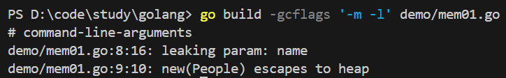
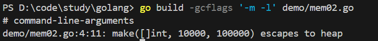
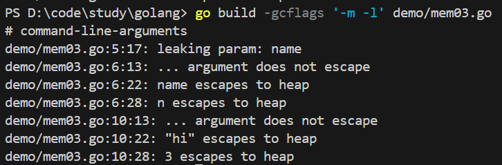
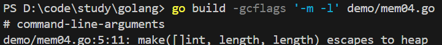

<!-- @import "[TOC]" {cmd="toc" depthFrom=1 depthTo=6 orderedList=false} -->

<!-- code_chunk_output -->

- [内存](#内存)
  - [变量在堆or内存](#变量在堆or内存)
    - [编译器打印逃逸情况](#编译器打印逃逸情况)
    - [逃逸情况分析](#逃逸情况分析)
      - [指针逃逸](#指针逃逸)
      - [栈空间不足](#栈空间不足)
      - [动态类型逃逸](#动态类型逃逸)
      - [大小在编译期间无法确定](#大小在编译期间无法确定)
    - [性能分析](#性能分析)

<!-- /code_chunk_output -->


# 内存
## 变量在堆or内存
golang编译器会根据变量是否被外部引用决定是否逃逸，如果没有被外部引用，**优先**分配到栈上.如果有被外部引用，则一定分配到堆上,new不一定会分配到堆上
### 编译器打印逃逸情况
```bash
go build -gcflags '-m -l' main.go
```
### 逃逸情况分析
#### 指针逃逸
函数返回一个局部变量的指针
@import "demo/mem01.go"
使用`go build -gcflags '-m -l' demo/mem01.go`进行分析，打印如下

`new(People) escapes to heap`，出现这个代表这个空间已经逃逸到了堆上

#### 栈空间不足
分配大对象，导致栈空间不足，不得不分配到堆上，测试源码如下
@import "demo/mem02.go"
使用`go build -gcflags '-m -l' demo/mem02.go`进行分析，打印如下


#### 动态类型逃逸
很多函数的参数为`interface`类型，比如fmt中很多的函数和一些框架底层的函数，测试代码如下
@import "demo/mem03.go"
使用`go build -gcflags '-m -l' demo/mem03.go`进行分析，打印如下


#### 大小在编译期间无法确定
一些大小是根据变量来的，会导致分配到堆上
@import "demo/mem04.go"


### 性能分析
- 堆的分配内存比栈上分配内存小的多
- 尽可能使用栈上分配内存，尽可能在编译期间确定变量的作用于和大小
