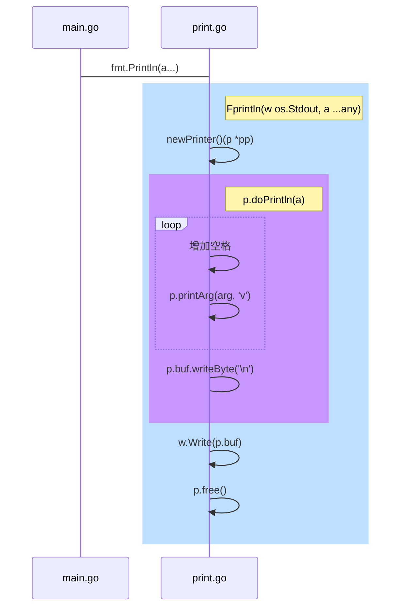

# 安装Golang{ignore=true}
本教程以ubuntu 22.04为例,安装教程参考[官方安装教程](https://go.dev/doc/install/source),源码版本为1.22

<!-- @import "[TOC]" {cmd="toc" depthFrom=1 depthTo=6 orderedList=false} -->

<!-- code_chunk_output -->

- [准备](#准备)
  - [安装一些必须得软件(可忽略)](#安装一些必须得软件可忽略)
  - [下载源码](#下载源码)
  - [安装bootstrap 1.4](#安装bootstrap-14)
    - [下载go1.4源码](#下载go14源码)
    - [编译bootstrap](#编译bootstrap)
    - [设置环境变量](#设置环境变量)
  - [安装bootstrap 1.17](#安装bootstrap-117)
    - [下载go1.17源码](#下载go117源码)
    - [编译bootstrap](#编译bootstrap-1)
    - [设置环境变量](#设置环境变量-1)
  - [安装bootstrap 1.20](#安装bootstrap-120)
    - [下载go1.20源码](#下载go120源码)
    - [编译bootstrap](#编译bootstrap-2)
    - [设置环境变量](#设置环境变量-2)
- [测试](#测试)
  - [修改源码](#修改源码)
    - [分析println的源码](#分析println的源码)
    - [修改编译器源码](#修改编译器源码)
  - [编译编译器](#编译编译器)
  - [测试](#测试-1)

<!-- /code_chunk_output -->

## 准备
### 安装一些必须得软件(可忽略)
安装一些软件，阿里ubuntu22.04已经安装了，不需要安装
```bash
sudo apt install vim
sudo apt install gccgo-5
sudo apt install git
```

### 下载源码
```bash
git clone https://github.com/golang/go.git
```

### 安装bootstrap 1.4
一些高版本的go源码需要使用一些低版本go的编译器

#### 下载go1.4源码
```bash
cp $HOME/go $HOME/go1.4 -rf
cd $HOME/go1.4/src
git checkout release-branch.go1.4
```


#### 编译bootstrap
```bash
make.bash
```

#### 设置环境变量
```bash
export GOROOT_BOOTSTRAP=$HOME/go1.4
```

### 安装bootstrap 1.17
Go1.17需要Go1.4的Bootstrap

#### 下载go1.17源码
```bash
cp $HOME/go $HOME/go1.17 -rf
cd $HOME/go1.17/src
git checkout release-branch.go1.17
```
#### 编译bootstrap
```bash
GOOS=linux GOARCH=amd64 ./bootstrap.bash
# 重命令
cd ~
rm -rf ./go1.17
mv ./go-linux-amd64-bootstrap ./go1.17
```

#### 设置环境变量
```bash
export GOROOT_BOOTSTRAP=$HOME/go1.17
```


### 安装bootstrap 1.20
Go1.20编译器需要Go1.17的Bootstrap

#### 下载go1.20源码
```bash
cp $HOME/go $HOME/go1.20 -rf
cd $HOME/go1.20/src
git checkout release-branch.go1.20
```


#### 编译bootstrap
```bash
GOOS=linux GOARCH=amd64 ./bootstrap.bash
# 重命令
cd ~
rm -rf ./go1.20
mv ./go-linux-amd64-bootstrap ./go1.20
```

#### 设置环境变量
```bash
export GOROOT_BOOTSTRAP=$HOME/go1.20
# 永久生效（安装最后一个Bootsrap最好永久生效）
echo export 'GOROOT_BOOTSTRAP=$HOME/go1.20' >> ~/.bashrc
```

## 测试
### 修改源码
修改println的源码，使其在打印字符串前增加hello字符串。
#### 分析println的源码
在源码包中，很容易发现，println的路径，在src/fmt包下，根据println的调用链如下

#### 修改编译器源码
根据这个调用链，我们可以在doPrintln中，循环的printArgs的外面增加printArgs("hi")，具体代码如下
```go
func (p *pp) doPrintln(a []any) {
	// 增加下面这一行代码
	p.printArg("hi", 'v')
	for argNum, arg := range a {
		if argNum > 0 {
			p.buf.writeByte(' ')
		}
		p.printArg(arg, 'v')
	}
	p.buf.writeByte('\n')
}
```
### 编译编译器
```bash
cd $HOME/go/src
./make.bash
```
之后会在$HOME/go/bin下看到go的程序
### 测试
我们修改go自带的测试程序，编译进行测试
```bash
cd $HOME/go/test
vim ./print.go
```
我们增加fmt的包，使用fmt.Println("world")进行测试打印，整个源码如下
```go
package main

// 增加包
import "fmt"

func main() {
        println((interface{})(nil)) // printeface
        println((interface {        // printiface
                f()
        })(nil))
        println((map[int]int)(nil)) // printpointer
        println(([]int)(nil))       // printslice
        println(int64(-7))          // printint
        println(uint64(7))          // printuint
        println(uint32(7))          // printuint
        println(uint16(7))          // printuint
        println(uint8(7))           // printuint
        println(uint(7))            // printuint
        println(uintptr(7))         // printuint
        println(8.0)                // printfloat
        println(complex(9.0, 10.0)) // printcomplex
        println(true)               // printbool
        println(false)              // printbool
        println("hello")            // printstring
        // 增加下面这行代码进行测试
        fmt.Println("hello")            // printstring
        println("one", "two")       // printsp

        // test goprintf
        defer println((interface{})(nil))
        defer println((interface {
                f()
        })(nil))
        defer println((map[int]int)(nil))
        defer println(([]int)(nil))
        defer println(int64(-11))
        defer println(uint64(12))
        defer println(uint32(12))
        defer println(uint16(12))
        defer println(uint8(12))
        defer println(uint(12))
        defer println(uintptr(12))
        defer println(13.0)
        defer println(complex(14.0, 15.0))
        defer println(true)
        defer println(false)
        defer println("hello")
        defer println("one", "two")
}
```
会看到改目录下会新增一个print的程序，直接运行`./print`，就会看到`hihello`，证明修改编译器成功，当然为了美观，你可以修改为新增`hi:`

