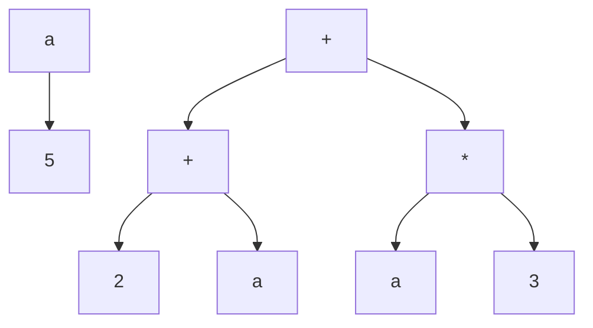
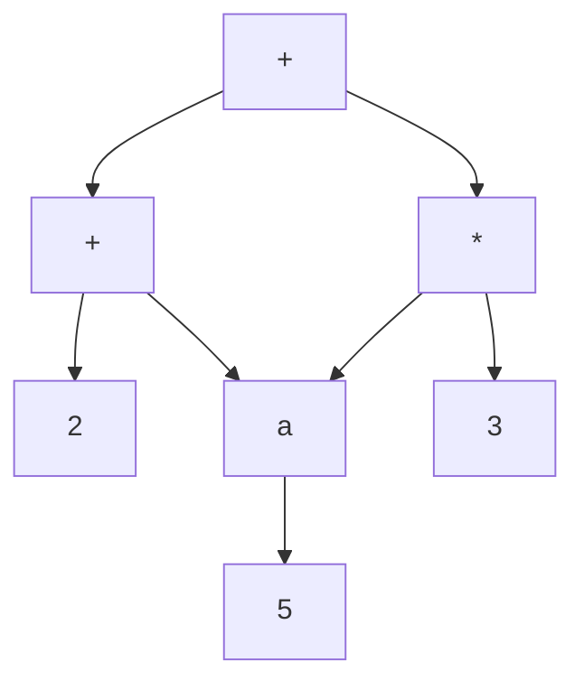
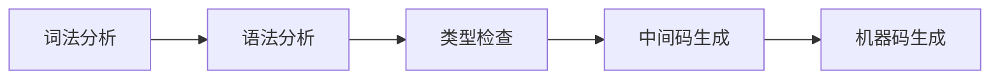
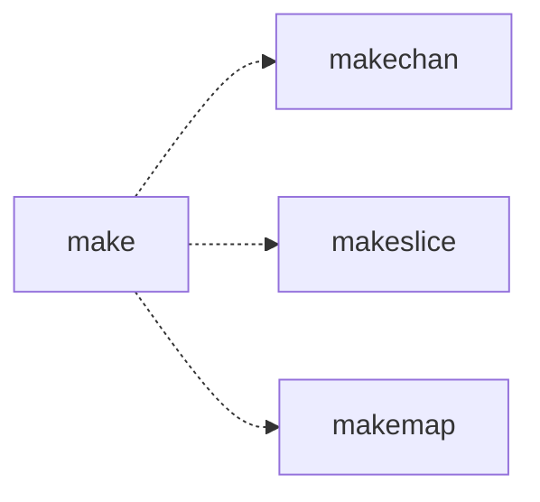
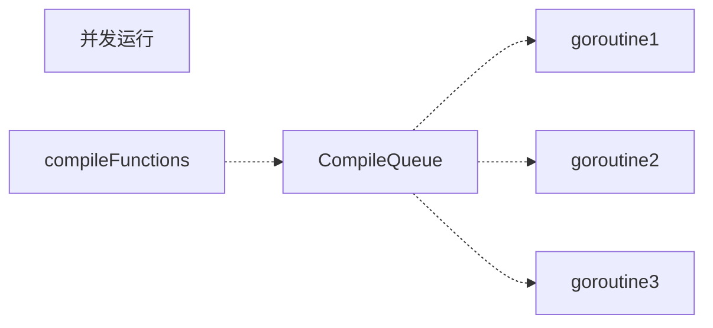
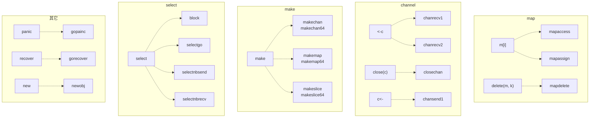
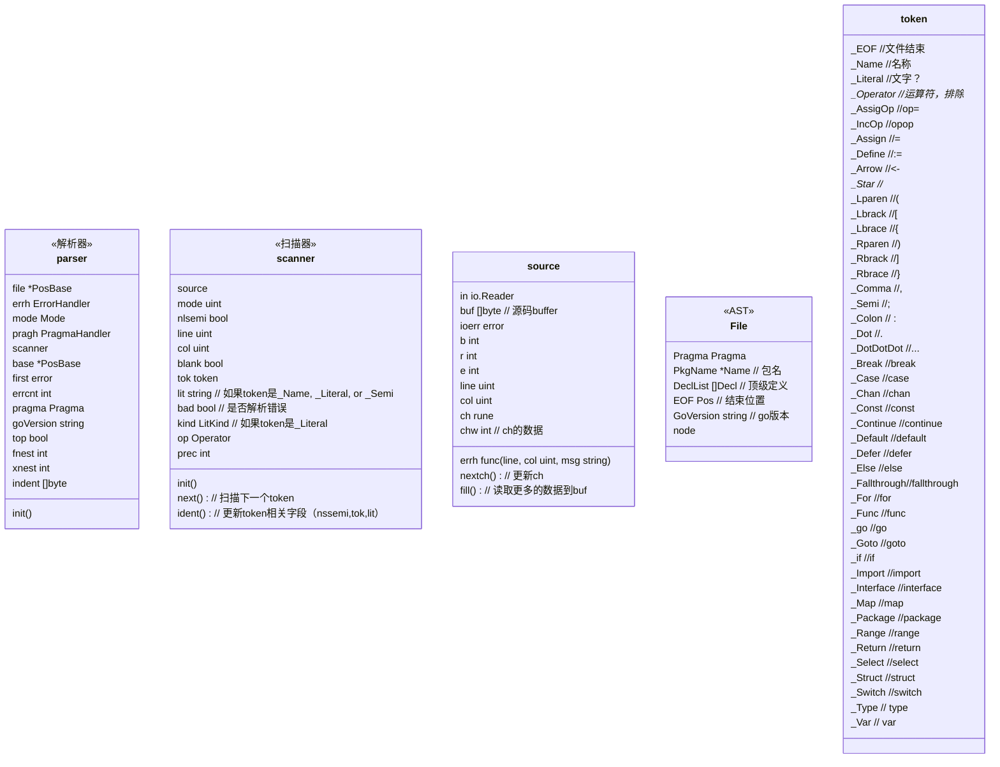
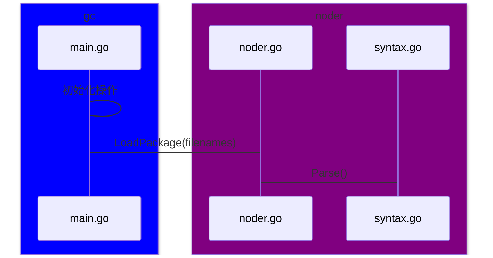

<!-- @import "[TOC]" {cmd="toc" depthFrom=1 depthTo=6 orderedList=false} -->

<!-- code_chunk_output -->

- [理论](#理论)
  - [IR](#ir)
    - [分类](#分类)
      - [分析转换](#分析转换)
        - [HIR](#hir)
        - [MIR](#mir)
        - [LIR](#lir)
      - [解释执行](#解释执行)
    - [IR的数据结构](#ir的数据结构)
      - [线性结构(Linear Form)](#线性结构linear-form)
      - [树形结构(Tree)](#树形结构tree)
      - [有向无循环图(Directed Acyclic Graph,DAG)](#有向无循环图directed-acyclic-graphdag)
      - [程序依赖图(Program Dependence Graph, PDG)](#程序依赖图program-dependence-graph-pdg)
    - [IR的设计范式](#ir的设计范式)
      - [SSA](#ssa)
- [golang编译原理](#golang编译原理)
  - [词法分析和语法分析](#词法分析和语法分析)
    - [声明](#声明)
    - [语句](#语句)
    - [表达式](#表达式)
  - [类型检查](#类型检查)
    - [静态类型检查](#静态类型检查)
    - [动态类型检查](#动态类型检查)
    - [Golang类型检查](#golang类型检查)
  - [中间代码生成](#中间代码生成)
    - [SSA配置初始化](#ssa配置初始化)
    - [遍历和替换](#遍历和替换)
    - [SSA代码生成](#ssa代码生成)
  - [机器码生成](#机器码生成)
    - [指令集](#指令集)
    - [机器码生成](#机器码生成-1)
- [源码解析](#源码解析)
  - [包说明](#包说明)
    - [src/cmd/compile](#srccmdcompile)
      - [internal](#internal)
        - [*gc*](#gc)
        - [*base*](#base)
        - [*types*](#types)
        - [*ir*](#ir-1)
        - [*dwarfgen*](#dwarfgen)
        - [*ssagen*](#ssagen)
        - [*typecheck*](#typecheck)
        - [*noder*](#noder)
        - [*reflectdata*](#reflectdata)
        - [*syntax*](#syntax)
  - [流程图](#流程图)

<!-- /code_chunk_output -->

编译原理
===
建议先看目录哦，这个第一次看源码写笔记，刚开始后有点混乱，后面会慢慢再调整结构的。
## 理论
### IR
IR是中间代码，英文为Intermediate Representation，简称IR。编译器在完成前端工作后，先生成IR，然后再进行代码优化。IR主要有两个用途，一个是用来做分析和转换的。另外一个主要用来解释执行的。
#### 分类
##### 分析转换
这里分析转换主要是分析、优化源码或者转换出目标代码做准备工作，IR主要分为以下三类HIR，MIR，LIR。
###### HIR
HIR是高级语法分析，AST算是一种HIR，做一些代码AI建议等都属于这个层次，主要是针对源代码级别的。
###### MIR
MIR是一种中间的表示，比高级语法更简洁，又没有CPU指令那么底层，主要是针对源码进行了一些优化处理，然后生成最后的目标码。这种表示跟CPU架构无关。比如TAC(Three Address Code)，也就是三变量，大概就是等号左右一个变量，右边两个变量和一个操作符
以下是一段Go代码
```go
func foo(a int) int {
  b := 0;
  if ( a > 10)
    b = a
  else
    b = 10
  b
}
```
对应的TAC可能是
```c
L1:
  b := 0
  if a > 10 goto L3
L2:
  b := 10
  goto L4
L3:
  b := a
L4:
  return b
```
######  LIR
跟CPU架构有关，一般是为了生成汇编代码，一会会与汇编代码一一对应

##### 解释执行
一般的解释器，可以在任意机器上解释执行，与操作系统和cpu架构无关，像Java字节码就是这样的。

#### IR的数据结构
IR数据结构没有固定的，也有文本和二进制的，下面主要说一下主流的结构
##### 线性结构(Linear Form)
简单理解就是 `顺序执行`加`goto`就行，TAC就是简单的例子
##### 树形结构(Tree)
AST就是一种树形结构，可能会有冗余子树，例如代码
```go
a := 5
b = (a+2) + a * 3
```
他的树形IR结构可能如下

##### 有向无循环图(Directed Acyclic Graph,DAG)
DAG是在树结构的基础上消除了冗余树。比如上面的例子转换成DAG后，如下图所示

一般用在目标代码的生成环节，块内代码的表示
##### 程序依赖图(Program Dependence Graph, PDG)
程序以来图显式的把程序中的数据依赖和控制依赖表示出来，形成一个图状的数据结构。基于这种数据结构，再进行优化会简单一些
#### IR的设计范式
##### SSA
SSA是Static Single Assignment的缩写，也就是静态单赋值。这是IR的一种设计范式，它要求一个变量只能被赋值一次，看一段Go代码
```go
y := x1 + x2;
y := y + x3;
y := y + x4;
```
其中y被赋值了3次，如果写成SSA形式
```go
y1 := x1 + x2;
y2 := y1 + x3;
y := y2 + x4;
```
这种设计范式可以保证一个变量的值被赋值一次后，不会再进行改变，对于优化代码减轻了很多压力。
- phi指令
对于一些条件赋值来说，可以使用phi指令，如一个变量可能是a，也有可能是b，如
```go
func max(a, b int) int {
  ret := 0
  if (a > b)
    ret = a
  else
    ret = b
  return ret
}
```
用SSA表示
```go
T1:
  ret1 := 0
  if a > b goto L3
T2:
  ret2 := a
  goto T4
T3:
  ret3 := b
T4:
  ret := phi(L2, L3, ret2, ret3) 
```
phi会根据前序节点做判断，如果前序节点是L2，那么就返回ret2，如果前序节点是L3，就返回ret3。
- 目前主流的IR优化的都基于SSA，包括Java的JIT编译器/JavaScript的V8编译器/Go语言的gc编译器


## golang编译原理
这里主要说一下大概得流程和源码包的介绍，编译大概总共分为4个步骤，前2个步骤主要是前段，后2个步骤主要是后端，其中中间代码的生成主要也是在后端。

### 词法分析和语法分析
这个是第一阶段，该阶段是把源文件先解析出token，此阶段叫做词法分析，比如 `package`，`"main"`, `func`等，然后根据这些词，按照语法树的结构进行组装，形成词语之间的关系。其中语法树包含声明、语句、和表达式。也包括源文件和语法书的对应关系，方便输出调试信息。
- 源码主要路径如下：
`cmd/compile/internal/syntax`
- 词法分析
入口文件：`cmd/compile/internal/syntax/scanner.go`
token：`cmd/compile/internal/syntax/token.go`
#### 声明
一般是类型的定义、函数的定义等
#### 语句
一般是程序执行的基本单元
#### 表达式
一般是求值的过程

### 类型检查
这是第二阶段，类型检查会按照下面流程进行验证和处理
1.常亮、类型、函数名及类型
2.变量的赋值和初始化
3.函数和闭包的主体
4.哈希键值对类型
5.导入函数体
6.外部的声明
7.根据make的第一个参数堆make进行改写


主要源码：
`cmd/compile/internal/types2`
#### 静态类型检查

#### 动态类型检查

#### Golang类型检查

### 中间代码生成
在类型检查后，会通过一个名叫compileFunctions的函数开始堆整个go进行编译，编译过程会有几个goroutine进行消费。

#### SSA配置初始化
这个是生成中间代码的一些准备工作，在这个过程中主要会缓存可能用到的类型指针、初始化SSA的一些配置和之后会调用的运行时函数，还有**cpu架构设置，用于生成中间代码和机器码的函数，当前编译器使用的指针、寄存器大小、可用寄存器列表、掩码等编译选项**。
入口文件:
`src/cmd/compile/internal/gc/ssa.go`
#### 遍历和替换
会对抽象语法树中的一些元素进行替换
```go
func walk(fn *Node)
```


#### SSA代码生成
经过walk处理后，AST语法树就不会改变了，Go编译器会使用compileSSA(`src/cmd/compile/internal/gc/pgen.go`)函数，将抽象语法树换成中间码

### 机器码生成
机器码是根据中间码生成汇编语言，编译器会根据cpu指令集将中间码编译成机器码
#### 指令集
主要分为复杂指令集(CISC)和精简指令集(RISC)，一般嵌入式为精简指令集（ARM架构），PC为复杂指令集（x86架构）。
#### 机器码生成
机器码生成主要分成两个部分，一部分是中间码降级，主要根据架构进行优化(`src/cmd/compile/internal/ssa`)。第二部分是生成机器码(`src/cmd/internal/obj`)

## 源码解析
### 包说明
#### src/cmd/compile
这个是编译器的入口口，里面有main函数。
##### internal
里面没有实际代码，主要看子包
###### *gc*
golang compile的简称，也是一个内部的入口包，负责一些主要流程的调用、初始化、以及最后生成二进制文件
###### *base*
主要是工具类、全局变量、上下文、命令行解析等
###### *types*
主要是类型的处理，func也属于一个类型
###### *ir*
主要负责中间代码的生成和优化
###### *dwarfgen*
主要是调试信息
###### *ssagen*
生成ssa
###### *typecheck*
类型检查
###### *noder*
高级代码解析
###### *reflectdata*
反射数据
###### *syntax*
+ 关键字算法
关键字也是token中的一种，go语言中40多个。在go代码中，token是一个token类型，用int表示。
  - hash
源码语法、词法解析包。里面有个keywordMap[1 << 6]token，里面存的所有go的关键字。通过hash函数进行映射。hash函数大概是第一个字节和第二个字节进行亦或。加上（token长度）与（keymap长度-1）(1<<6-1)。在init的时候如果hash冲突就会panic。
  - token_name
_token_name是一个常亮字符串，` "EOFnameliteralopop=opop=:=<-*([{)]},;:....breakcasecha....`，然后token_name会跟token一一对应。通过一个长字符串和相对位置进行表示，通过 go:generator进行表示。
+ 关键方法
  - scanner.ident()
可以识别go的关键字和变量名
  - scanner.next()
识别下一个token
  - parser.filrOrNil()
解析一个源文件到语法树
  - parser.got(tok)
返回当前是否为tok的token
  - parser.want(tok)
如果当前不是tok，则会有错误反馈
  - parser.appendGroup(目标，解析函数)
解析一个表达式的值，可以是a=`(x,y,z)`或a=`x`
  - parser.exprList()
解析表达式列表
  - parser.expr()
解析一个表达式
  - parser.list("上下文提示字符串", 分隔符， 结束符，每个的处理函数)
主要处理列表形式的定义
  - parser.appendGroup(list []Decl, f func(*Group) Decl) []Decl

+ 流程图展示
下面主要展示一个`var a = (1,2)`

+ 核心类

### 流程图
