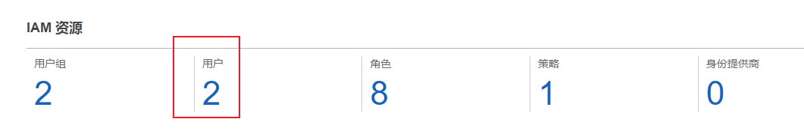

# AWS

> https://github.com/acmesh-official/acme.sh/wiki/How-to-use-Amazon-Route53-API
 
## 申请Key
### 创建用户
指定类型为API


### 申请API
选择Route 53 Full API

### 申请成功


## 导入Key
```shell
export  AWS_ACCESS_KEY_ID=XXXXXXXXXX
export  AWS_SECRET_ACCESS_KEY=XXXXXXXXXXXXXXX
```

## 安装证书
```shell
./acme.sh --issue --dns dns_aws -d example.com -d www.example.com
```

