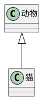
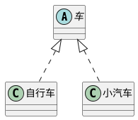
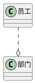
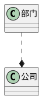
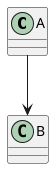

## uml线条
* 空心箭头 -- 实现或者继承
* 箭头 -- 关系
* 菱形 -- 组合

### 泛化关系（继承）

### 实现关系（实现）

### 聚合关系
表示一部分由另外一部分组成，弱依赖。整体解散了，组成部分还存在

### 组合关系
整体解散了，组成部分必定解散

### 关联关系
用实线表示，如果强调方向，可带箭头，如A知道B，B不知道A。不强调运行时

### 依赖关系
一般强调运行时的依赖关系

### 时序图
展示对象之间的交互细节