## 概览
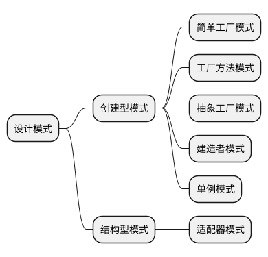

### 创建型模式
主要就是为了创建对象，分离对象的创建和使用

#### 简单工厂模式

又称为静态工厂模式

#### 工厂方法模式

有一个公共的工厂抽象类，具体生成由子工厂类具体实现

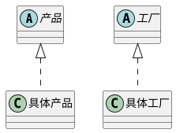

#### 抽象工厂模式
用于创建一系列产品或者相互依赖的产品，
相对于工厂方法模式，该模式适用于一个体系的产品对象产生

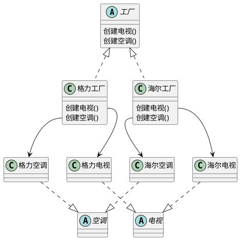

#### 建造者模式
可根据某些条件，流程去创建对象。该模式适用于复杂对象的创建
该模式一般包含一个指挥者，指挥者控制整个构建的流程。
如果建造者只有一个的情况下，可以合并指挥者和建造者

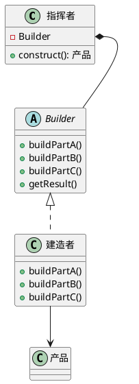

#### 单例模式
在某些系统中，有些实例可能只需要一个，如根对象、全局配置对象。

```plantuml
class Singleton {
    - instance: Singleton
    + getInstance(): Singleton
}

Singleton *-- Singleton

note "if(instance == null)\n\tinstance = new Singleton();\nreturn instance;" as N1 
Singleton::getInstace -- N1
```

### 结构型模式
此模式关心类(或对象)的组合形式
#### 适配器模式
将一个接口转为客户希望的另外一个接口
* Target: 目标抽象类
* Adapter: 适配器类
* Adaptee: 适配者类
* Client: 客户类
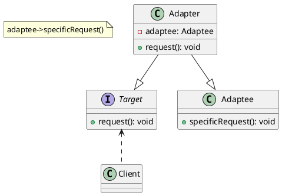

#### 桥接模式
将抽象部分与实现部分分离，使他们可以独立的变化。
尽量将一些公共实体的流程、操作提取到抽象类中。

* Abstraction: 抽象类
* RefinedAbstract: 扩充抽象类
* Implementor: 实现类接口
* ConcreteImplementor: 具体实现类

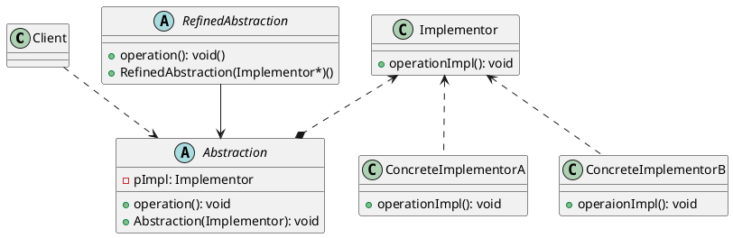

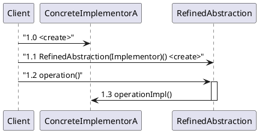

#### 装饰模式
动态地给一个对象增加一些额外地职责(就是增加对象功能)，装饰模式比生成子类实现更为灵活。
装饰模式就是将一个类对象嵌入到另一个对象中。

* Component: 抽象构件
* ConcreteComponent: 具体构件
* Decorator: 抽象装饰类
* ConcreteDecorator: 具体装饰类

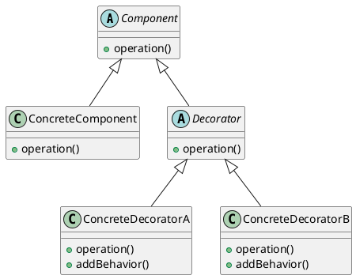

#### 外观模式
外部与一个子系统通讯必须通过油一个统一地外观对象进行，为子系统地中地一组接口提供一个一致地界面，外观模式定义了一个高级接口，这个接口使得这一子系统更加容易使用。

* Facade: 外观角色
* SubSystem: 子系统角色

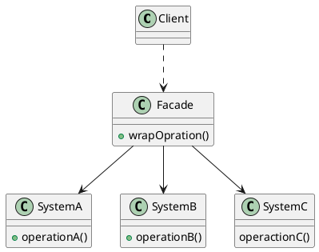

#### 享元模式
运用共享技术有效地支持大量细粒度对象地复用。

* Flyweight: 抽象享元类
* ConcreteFlyweight: 具体享元类
* UnsharedConcreteFlyweight: 非共享具体享元类
* FlyweightFactory: 享元工厂类

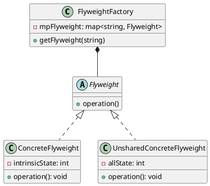

#### 代理模式
给某一个对象提供一个代理，并由代理对象控制对愿对象的饮用。

* Subject: 抽象主题角色
* Proxy: 代理主题角色
* RealSubject: 真实主题角色

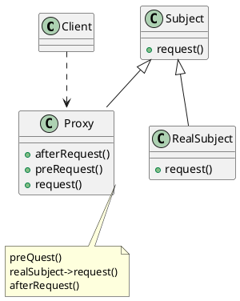

### 行为型模式
主要关注对象之间的责任和算法抽象化。
#### 命令模式
是一个对象行为模式。
典型的有消息队列，请求者只需要发出命令，不关注接收者

* Command: 抽象命令类
* ConcreteCommand: 具体命令类
* Invoker: 调用者
* Receiver: 接收者
* Client: 客户类

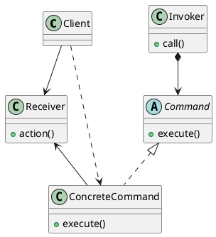

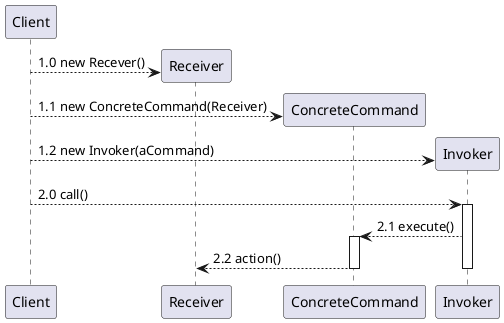

#### 中介者模式
用一个中介对象来封装一系列的对象交互，中介者使各对象不需要显式的相互引用，从而使其解偶。

* Mediator: 抽象中介者
* ConcreteMediator: 具体中介者
* Colleague: 抽象同事类
* ConcreteColleague: 具体同事类

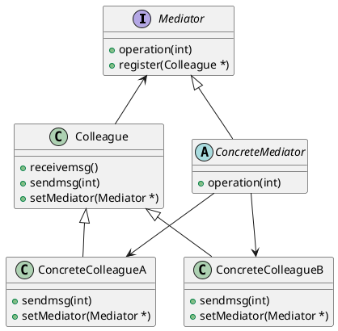
同事有一个代理的实体，发送消息通过代理去发送

#### 观察者模式
定义对象间的一种一对多依赖关系，使得每当一个对象状态发生改变时， 其相关依赖对象皆得到通知并被自动更新。
观察者模式又叫做发布-订阅（Publish/Subscribe）模式、模型-视图（Model/View）模式、源-监听器（Source/Listener）模式或从属者（Dependents）模式。

* Subject: 目标
* ConcreteSubject: 具体目标
* Observer: 观察者
* ConcreteObserver: 具体观察者

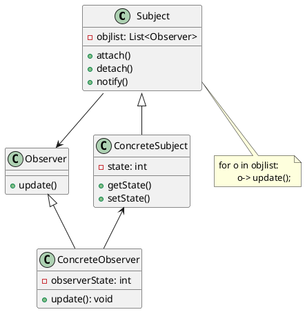

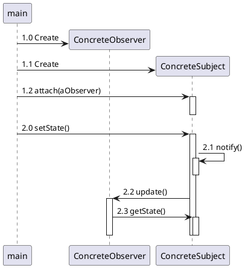

#### 状态模式
在很多情况下，一个对象的行为取决于一个或多个动态变化的属性，这样的属性叫做状态。

一个对象在其内部状态改变时改变它的行为

