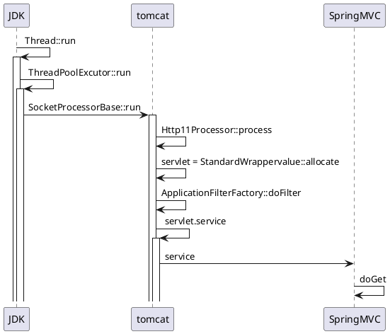

## 前言
今天遇到一个问题，Controller返回的字段没有域名，但是chrome看前端接口却有域名，于是想看看怎么回事

### 大概的流程图

```plantuml
@startuml
JDK -> JDK ++: Thread::run
JDK -> JDK ++: ThreadPoolExcutor::run
JDK -> tomcat ++: SocketProcessorBase::run
tomcat -> tomcat : Http11Processor::process
tomcat -> tomcat : servlet = StandardWrappervalue::allocate
tomcat -> tomcat : ApplicationFilterFactory::doFilter
tomcat -> tomcat ++: servlet.service
tomcat -> SpringMVC : service
SpringMVC -> SpringMVC : doGet


@enduml
```